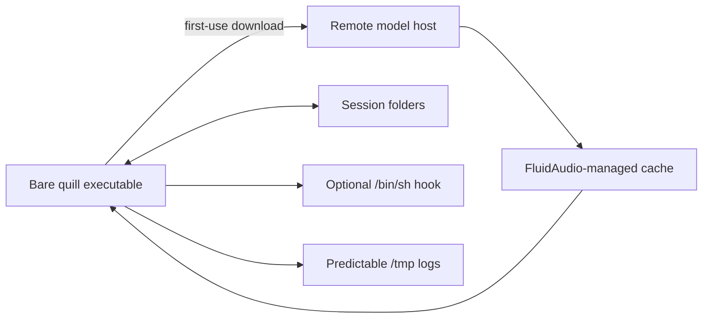
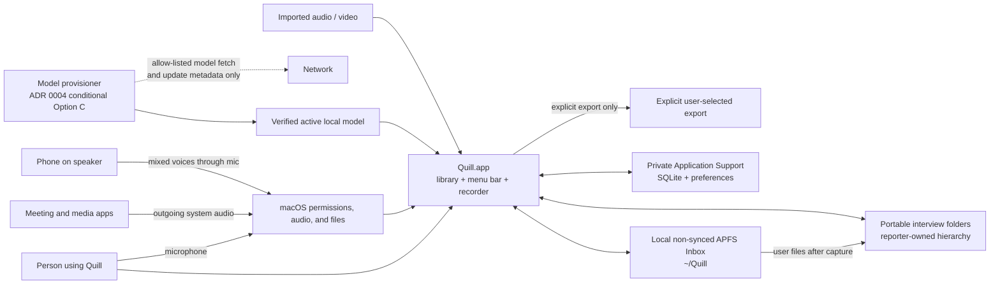
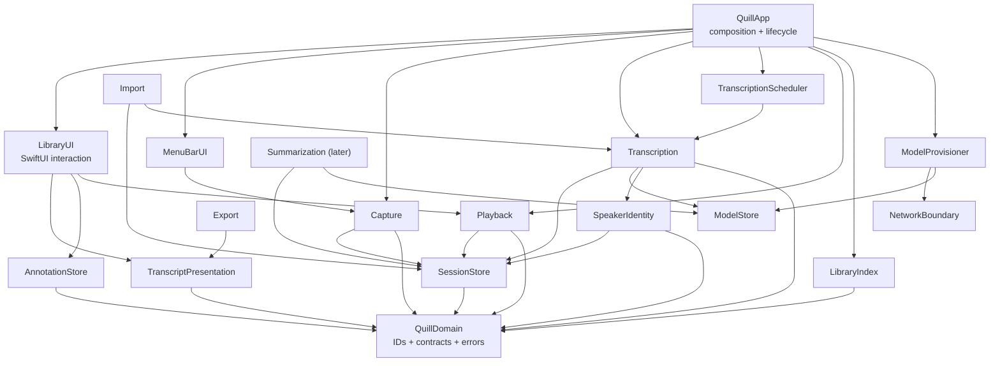
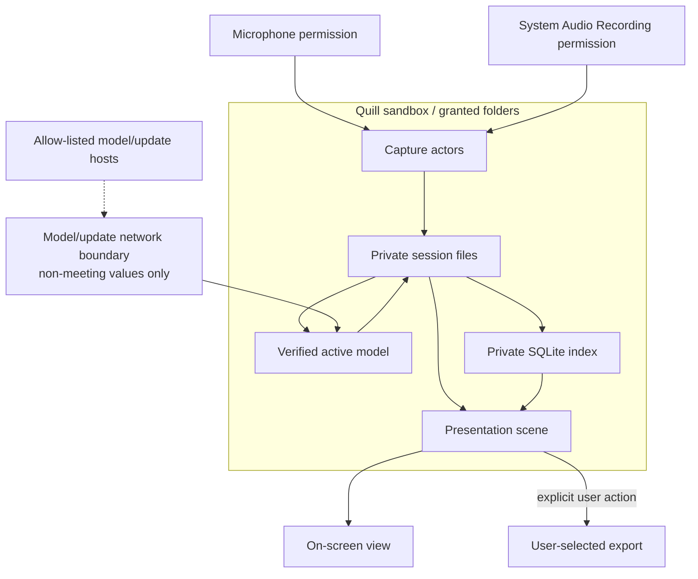

# Quill v2 Architecture Baseline

Status: **Accepted**
Date: 2026-07-29
Scope: architecture and contracts only; no feature implementation or data migration

## Outcome

Quill v2 should begin as one Developer ID-signed SwiftUI macOS application with
a menu-bar presence and a regular library window. Recording, transcription,
indexing, and rendering remain in that process but are isolated behind actor
and protocol boundaries. A recorder helper is deferred until a measured
reliability requirement justifies its IPC, signing, permission, and update
costs.

Each interview folder is a portable package whose evidence, details, and
session-local overlays are canonical. The reporter's Finder hierarchy is the
organizational authority. A SQLite database in Application Support remembers
locations, owns operational job ordering/leases, and acts as a rebuildable
content index/cache; it does not replace the reporter's story folders and must
never become a second canonical copy of an annotation, transcript, correction,
or speaker label.

Transcript v2 preserves word timing and separates four identities that must not
be conflated:

1. the logical session,
2. a particular transcript generation,
3. a session-local speaker hypothesis,
4. a future, explicitly confirmed person record.

This is a target architecture, not a description of the current executable.
The present code downloads its model at runtime, has no Quill-controlled model
hash verification, runs an optional shell hook, writes LaunchAgent logs under
`/tmp`, creates session metadata only on clean stop, and has no tests or CI.
Those gaps are prerequisites in the delivery plan.

The first release slice is:

> install/launch → complete or visibly defer readiness → record an online or
> phone-speaker interview, or import media → preserve playable source audio →
> transcribe locally → review uncertain text → confirm a speaker name or
> correct text without losing the machine original → quit/reopen → move the
> interview folder in Finder → remap it and observe the same evidence and
> overlay

## Product contract

Quill is a reporter's private transcript recorder and evidence browser. It is
not a meeting assistant. Its primary job is to preserve an interview, produce
an accurate navigable transcript, and let the reporter verify exact language
against the recording. Audio is the final authority.

The first audience is two individual reporters using their own local folder
systems. The product therefore optimizes for:

- online meetings running on the Mac;
- phone calls played on speaker beside the Mac microphone;
- imported audio and video;
- accuracy over immediate transcript latency;
- literal copying into a story;
- honest uncertainty and user-verified speaker names;
- consumer-grade DMG installation and guided readiness for a nontechnical
  reporter.

Version 1.0 includes media import, folder remapping, speaker naming, a
`Needs Human Intervention` queue, and non-destructive user corrections. Global
search, Hot Quote and Fact Check reports, anchored comments, shared subject
dictionaries, formatted exports, and advanced storage management may be
designed as extensions but are not release blockers. Hot Quote and Fact Check
are explicit 1.1 candidates; their future timeline anchors must not require a
transcript to exist when a marker is created.

Permanent product exclusions are meeting bots or participant announcements,
Quill-hosted cloud accounts/synchronization, coaching/sentiment/talk-time
scoring, promotional feature pop-ups, and unverified claims about a source's
identity. Calendar assistance may be a later, quiet opt-in. A short dismissible
tutorial is allowed.

## Scope and non-goals

This baseline covers process boundaries, module dependencies, data ownership,
identity, transcript and annotation contracts, privacy, failure behavior,
verification, and delivery order.

It deliberately does not:

- implement the library or migrate a session;
- promise automatic Zoom or Google Meet identity association;
- introduce accounts, synchronization, collaboration, or a server;
- store cross-session voice embeddings;
- capture screen or camera video during a live meeting;
- make Hot Quote, Fact Check, comments, global search, or formatted export a
  1.0 release requirement;
- choose an auto-update framework;
- claim App Sandbox compatibility before the real Core Audio capture path is
  exercised in a signed sandboxed app.

## Verified current state versus target

| Area | Current repository / installed state | Required target |
| --- | --- | --- |
| Model provisioning | `AsrModels.downloadAndLoad(version: .v2)` downloads about 600 MB into FluidAudio's cache | accepted ADR 0004 option plus Quill-owned manifest, staging, and hash verification |
| Network | first transcription can require outbound network access; no Quill-owned egress boundary | meeting-derived data has no network path; entitlement follows the measured ADR 0004 choice |
| Executable identity | installed binary is ad hoc linker-signed, has no Team ID, and is not notarized | stable Developer ID `.app` identity, hardened runtime, notarization, stapled ticket |
| Existing installation ACL | audited `/usr/local/bin` and `quill` are `root:wheel` `0755`, so replacement on this Mac requires privilege | release security must rely on code identity, not assume any installation path has safe ownership |
| Stop hook | config-supplied text is executed through `/bin/sh -c`; config ownership/mode is not validated | remove the consumer hook before app migration |
| Launch logs | predictable world-visible `/tmp/quill.out.log` and `quill.err.log` paths | unified logging plus private redacted diagnostics |
| Crash discovery | `meta.json` is written only on clean stop; errors are swallowed; pending scan requires that file | durable manifest created before capture and atomically transitioned through lifecycle states |
| Recorder concurrency | mic suppresses checking with `@unchecked Sendable`; callback/main state races; system IOProc performs AAC and disk I/O | single-owner recorder state, bounded real-time handoff, non-real-time writers, surfaced health failures |
| Runtime configuration | `Config.load()` is re-read independently by accessors | immutable validated startup snapshot passed to services |
| Queue identity | URLs are compared without standardization | normalized file identity and explicit duplicate-job keys |
| Duration | wall-clock duration is persisted | track duration comes from frames/timebase; wall clock is separate metadata |
| Capture semantics | microphone is treated as `self`; both tracks are assumed equally required | an explicit capture profile declares primary/secondary/unused sources; phone-speaker mic may contain multiple people |
| Organization | generated date folders under one recordings root | safe non-synced Inbox at `~/Quill`, portable interview folders, Finder-owned nesting, and explicit remapping |
| Corrections | no durable correction provenance | corrected reading text is an overlay; the machine original remains inspectable and every edit is flagged |
| Documentation drift | mic comment says voice processing is default-on while config/README say off; tap comments mention 14.2 while the product floor is 15 | code comments, README, package, CI, and release metadata agree with runtime behavior |
| Tests and CI | no `Tests/` target and no `.github/workflows/` | test target for every production module and required CI gates |

The installed binary observation is deliberately narrower than a generic
Homebrew warning: this audited host is not group-writable. The architectural
problem is that an ad hoc/path-oriented identity is not a durable product
security boundary and changes when Quill becomes a signed app.

## Council decision

The architecture council reached strong consensus on one application process
and session-local speaker identity. Its material disagreement was whether
annotations belong only in SQLite or in folder sidecars.

- **Architect:** one app; folder-canonical evidence; SQLite for location/job
  state and derived indexes; versioned word-level transcript.
- **Skeptic:** avoid a helper and global person model; SQLite-only annotations
  are acceptable only with early export/backup.
- **Pragmatist:** portable sidecars make annotations recoverable; SQLite should
  accelerate discovery and search.
- **Critic:** one authority per datum; sidecars need atomic replacement,
  conflict detection, and explicit duplicate handling.

The strongest dissent is the operational simplicity of SQLite-only
annotations. It is rejected because losing or moving the database would also
lose the user's work while the corresponding session folder still appeared
complete. The adopted design pays the sidecar coordination cost explicitly.
Subsequent reporter workflow discovery also rejected an app-owned project
hierarchy for 1.0: Finder nesting is the organizational authority and Quill
remaps moved folders.

The proposed decisions are recorded in:

- [ADR 0001: Begin with one application process](adr/0001-single-application-process.md)
- [ADR 0002: Session folders own evidence and overlays](adr/0002-folder-authority-and-sqlite-index.md)
- [ADR 0003: Version transcripts and scope identity explicitly](adr/0003-versioned-transcripts-and-scoped-identity.md)
- [ADR 0004: Choose verified model provisioning](adr/0004-verified-model-provisioning.md)

## System context

### Current implementation



### Proposed target with verified first-use model download pending evidence



The protected property is that no meeting-derived data reaches the provisioner
or network. Product discovery selected a small DMG plus verified first-use
download as the intended experience, so ADR 0004 now conditionally selects
Option C pending its full-size integrity, repair, entitlement, and network
evidence. The broad outgoing-network entitlement cannot express “models and
updates only,” so the design pays for it with a narrow network module,
meeting-type exclusion at compile time, static-import checks, and captured
network tests. Until ADR 0004 is accepted, Quill's actual model path remains
networked and its integrity behavior is whatever FluidAudio provides.

## Application and process shape

### Decision

Use one `.app` process with:

- a supported deployment floor of macOS 15 or later;
- a normal SwiftUI window scene for the library and transcript;
- a menu-bar scene or AppKit status-item adapter for fast recording control;
- `SMAppService.mainApp` for user-approved launch at login;
- an internal `CaptureCoordinator` boundary that owns all recording state;
- actors for capture, transcription jobs, session writes, and indexing;
- no XPC service, LaunchAgent, daemon, or privileged helper.

Closing the library window does not terminate the application. Explicit Quit
while recording presents a stop-and-finalize decision; it may not silently
discard or abandon capture.

The tap API exists on macOS 14.2, but Quill chooses macOS 15 as its product and
verification floor because the repository already declares 15 and there is no
exercised 14.x permission, capture, interruption, and packaging matrix.
Supporting one OS behavior line keeps the signed-app/TCC migration testable.
Lowering the floor requires a new exercised compatibility decision. Package
metadata, README, source comments, release checks, and CI must say the same
thing.

Moving from the current bare executable to a signed `.app` changes Quill's TCC
identity. Existing users must re-approve microphone and System Audio Recording
access. Migration onboarding detects the legacy LaunchAgent, explains the
re-permission, unregisters the old launch path only with explicit user action,
and verifies both permissions through real capture. Quill never edits the TCC
database.

First launch offers `~/Quill` through `NSOpenPanel` as the default local Inbox,
rejects file-provider/iCloud-synced storage, requests microphone and System
Audio Recording permissions, downloads or verifies the model, and runs an
audible two-source test. Readiness is a vector, not one boolean: storage,
microphone, system audio, model, and exercised test state remain independently
visible. Recording is allowed before a model is ready; the audio waits for
later transcription. A missing permission leaves setup visibly incomplete and
enables only compatible capture profiles.

### Capture profiles and source criticality

The start interaction asks “How are you recording?” and persists one explicit
profile:

| Profile | Primary evidence | Secondary evidence | Speaker prior |
| --- | --- | --- | --- |
| `online_meeting` | system audio (“Their Audio”) | microphone (“My Audio”) | mic may use a `self` prior only while capture and echo tests support it |
| `phone_speaker` | microphone from a handset on speaker | none | microphone is mixed speech; diarize without assuming speaker count or `self` |
| `phone_via_mac` | system audio from Continuity/FaceTime/phone bridge | microphone | preserve clean two-track evidence; same cautious `self` prior as an online meeting |
| `in_person` | microphone | none | microphone is mixed speech; diarize without assuming speaker count or `self` |
| `imported_media` | each user-selected part | explicitly linked companion tracks, if any | no identity prior unless imported provenance supplies one |

Track criticality is persisted per part as `primary`, `secondary`, or
`optional`; it is not inferred later from a filename or role. Failure of any
one track does not discard another healthy track. Quill attempts a safe
fallback, continues every recoverable track, changes the affected
red/yellow/green source indicator, sends a local notification, and marks the
capture/transcript degraded. A primary source failure produces the strongest
visible warning and may require acknowledgement, but it still preserves and
continues secondary evidence rather than deleting the session.

The recording popover shows recording state, elapsed time, separate health for
“Their Audio” and “My Audio” when applicable, Stop, and later-version marker
controls. Shortcuts for Start/Stop and marker actions are user-configurable.
Menu Stop is immediate; a keyboard Stop action requires a deliberate hold or
confirmation. Closing the main window never changes recording state.

The start flow is deliberately short:

> Record → choose Online Meeting, Phone on Handset Speaker, Phone Through Mac,
> or In Person → Start Now or Add Details

Add Details is optional and user-configurable. It may collect title, sources,
job titles, organizations, story/subject, private notes, a later shared
dictionary, and a destination chosen with a folder picker. Details can be
updated later. Metadata changes never silently rename or move the interview
folder.

The empty library home prioritizes Recent Interviews plus Record and Import.
The Inbox is a location/status badge on recent items, not a duplicate home
section. A later global search control remains compact and persistent; `⌘F`
always searches only the open transcript.

### Recording and transcription are independent

Capture never depends on the transcription model or queue. After Stop, Quill
asks whether to transcribe now. “Later” leaves a durable visible job that can
be manually ordered with other jobs. Active recording always outranks
transcription for compute and I/O.

When more than one job is pending, Quill surfaces their names and asks the
reporter to confirm order in a queue manager; ordering is editable without
restarting completed work.

An idle scheduler may start queued work only while the Mac is awake and unused.
It recommends external power, allows the display to sleep, and prevents idle
system sleep only while a job is running. It cannot promise computation during
system sleep or closed-lid suspension. If the user returns or the Mac sleeps,
the job checkpoints or pauses and resumes safely. Quill does not install a
privileged wake scheduler.

### Crash behavior

A one-process crash ends active capture. Before any requested recorder starts,
Quill creates a private session directory and atomically writes `session.json`
in the `starting` state with the selected profile, initial part, and track
criticality. Once at least one requested recorder is live and every other
requested recorder has either become live or recorded a typed failure, it
atomically transitions to `recording`; clean stop transitions to `complete`.
If no requested recorder can start, it writes `failed`. Lifecycle completion
means the process finalized what it captured, not that every requested source
was healthy.

“Started” means the recorder API returned successfully. “Live” means its first
buffer was accepted by the bounded handoff/writer and supplied a first-sample
time. A provisional three-second transition deadline begins with the first
recorder start attempt. At the deadline, any requested track that has neither
become live nor failed gets typed `start_timeout`, Quill attempts its safe
fallback, and the transition proceeds if another track is live. The measured
device matrix may change the constant, but an unbounded `starting` wait is
forbidden.

Signal health is separate from callback liveness. Exact digital-zero buffers
trigger the first-second voice-processing fallback from RCA-001; ordinary
acoustic quiet does not. Any later silence detector must be profile-calibrated
and cannot infer failure merely because nobody is speaking.

Terminal state has one decidable author:

- `failed`: the live Quill process observed a failure and successfully wrote a
  terminal state with a trusted typed failure payload;
- `interrupted`: a later startup scan found a `starting` or `recording`
  manifest and inferred that the prior process ended without a terminal write;
  it carries no trusted live-process failure payload.

If Quill observes an error but cannot persist `failed`, the next launch assigns
`interrupted`. A startup scan validates surviving tracks and offers recovery
and transcription. It never relies on clean-stop metadata to discover the
session and never labels inferred recovery `complete` or `failed`.
Recovery preserves any typed per-track failures that the live process already
persisted; `interrupted.failure` remains null only at the session level because
recovery does not know the cause of process termination.

Add a recorder helper only if one of these reconsideration triggers is met:

- a product requirement says capture must survive GUI process termination;
- exercised crash telemetry or reproducible tests show UI failures threaten
  otherwise healthy recordings;
- capture must independently restart while the GUI is unavailable;
- a required entitlement cannot safely live in the main app but works in a
  separately signed service.

The helper decision requires a new ADR and end-to-end tests for IPC loss,
version skew, permission ownership, app updates, and simultaneous crashes.

### Recorder execution rules

- Recorder mutable state has one explicit owner. `@unchecked Sendable` is not
  an accepted concurrency strategy.
- Callback threads publish first-buffer time, health, and errors through a
  synchronized channel; stop/fallback cannot race an in-flight file write.
- Recorder start has a bounded transition deadline; one pending pipeline
  cannot leave the manifest in `starting` while another writes unbounded audio.
- The Core Audio IOProc copies into a bounded preallocated ring buffer and
  returns. AAC conversion and filesystem writes occur on a non-real-time
  serial writer.
- Preserve the current defensive system-recorder cleanup order: stop/destroy
  IOProc, then aggregate device, then tap, then release the file.
- Ring-buffer overflow, writer failure, a zeroed live track, or failed raw-mic
  fallback becomes typed per-track degradation or failure plus a user
  notification. The app cannot continue displaying a healthy indicator, but
  it preserves and continues other healthy tracks when safe.
- Track duration is derived from audio frames and sample rate. Wall-clock
  start/end remain separate provenance.
- Startup produces one validated immutable runtime-configuration snapshot.
  Active jobs do not re-read configuration.
- All queued session URLs are standardized and keyed by stable session/job
  identity before comparison.
- Capture code contains no force-unwrapped destination URL. Process launches
  use `executableURL`.

## Module boundaries

The executable target becomes a composition root over focused SwiftPM library
targets. Framework-specific types stop at adapters; domain contracts use
Foundation value types.



### Responsibilities

| Module | Owns | Must not own |
| --- | --- | --- |
| `QuillDomain` | IDs, versioned Codable contracts, invariants, specific errors | AppKit, SwiftUI, SQLite, audio |
| `Capture` | profile-aware mic/system lifecycle, track criticality, health monitoring, shared timebase | UI, speaker identity, or transcript persistence |
| `SessionStore` | folder discovery, coordinated atomic writes, permissions, migrations | search ranking or presentation |
| `Transcription` | local job state, word timing, provenance, promotion rules | user speaker names or rendering |
| `TranscriptionScheduler` | durable ordering, now/later/idle policy, pause/resume, recording priority | privileged wake, model loading, or transcript mutation |
| `SpeakerIdentity` | session-local diarization clusters and candidate associations | silently confirmed human identity |
| `AnnotationStore` | compare-and-swap access to `annotations.json` | SQLite as a second authority |
| `LibraryIndex` | bookmarks, availability, path facets, FTS and rebuildable cache | virtual project authority or canonical transcript/annotation bodies |
| `Playback` | session timeline, derived mix validation, seek | transcript mutation |
| `TranscriptPresentation` | one semantic scene for screen/PDF/DOCX/script projections | filesystem or database access |
| `Import` | copied media, explicit part/track relationships, provenance, normalization | destructive edits to source media or automatic combination |
| `Export` | later PDF, DOCX, and script presets plus destination adapters | independent transcript meaning or silent upload |
| `ModelStore` | Quill manifest, staging, hash validation, activation, loading | unverified activation or meeting-derived inputs |
| `ModelProvisioner` | selected ADR 0004 install/fetch adapter | audio, transcript, annotation, identity, or summary values |
| `NetworkBoundary` | allow-listed model/update requests and redacted diagnostic handoff | meeting-derived values, generic upload, accounts, or telemetry |
| `Summarization` | later local generation with provenance | transcript evidence mutation |

Dependencies point toward `QuillDomain`. Feature modules communicate through
protocols injected by `QuillApp`; they do not import one another for
convenience.

`RuntimeConfiguration` is a validated immutable value constructed once by the
composition root and passed into modules that need it. No module reads the
configuration file independently.

The existing executable target embeds `Info.plist` with CWD-relative linker
`.unsafeFlags`. The app-bundle migration must remove that workaround before
target splitting; otherwise package restructuring can fail for build-layout
reasons unrelated to the intended module boundary.

## Data authority

### One authority per datum

| Datum | Canonical location | Recovery / derivation |
| --- | --- | --- |
| Audio evidence | session folder | never regenerated |
| Capture lifecycle and initial-track manifest | terminal `session.json` | legacy adapter reads `meta.json`; never rewritten after terminal transition |
| Interview details, ordered part links, transcript pointers | revisioned `state.json` | indexed from the folder; never SQLite-only |
| Added imported-part evidence | immutable `parts/<part-id>.json` + media | never rewritten; linked from `state.json` |
| Legacy metadata/transcript | original `meta.json` / `transcript.json` | retained unchanged |
| Transcript v2 generation | versioned file under `transcripts/` | can be regenerated as a new generation |
| Corrections, review resolution, annotations, and speaker labels | `annotations.json` | explicit export/backup; never SQLite-only |
| Readable Markdown | `transcript.md` | derived from active presentation |
| Playback mix | `derived/playback.m4a` + recipe | rebuilt from canonical tracks |
| PDF/DOCX/script export | user-selected destination | rendered from the same presentation scene and then treated as external |
| Finder organization | interview folder location and parent hierarchy | index remembers bookmarks and path facets |
| Search/library cache and durable job leases | Application Support SQLite | rebuilt/reconciled by scanning known locations and session manifests |
| Models | ADR 0004-selected Quill-controlled location | staged and activated only after manifest/hash verification |

### Session package

```text
<session-folder>/
├── session.json                         # capture lifecycle; immutable after terminal state
├── state.json                           # mutable details, ordered parts, transcript pointers
├── media/
│   ├── part-0001/
│   │   ├── their-audio.caf              # canonical evidence when applicable
│   │   └── my-audio.caf                 # canonical evidence when applicable
│   └── part-0002/
│       └── imported-original.ext         # copied canonical import
├── parts/
│   └── part-0002.json                    # immutable manifest for an added import
├── meta.json                            # retained legacy evidence, if present
├── transcript.json                      # retained legacy v1 evidence, if present
├── transcripts/
│   └── <transcript-id>.json             # immutable transcript v2 generation
├── annotations.json                     # mutable, revisioned session overlay
├── transcript.md                        # derived readable projection
├── derived/
│   ├── playback.m4a
│   └── playback.recipe.json
└── logs/                                # private structured job diagnostics
```

New v2 recordings write `session.json` before capture starts. That file owns
only capture identity, requested initial tracks, lifecycle transitions, trusted
per-track failures, and the terminal capture result. After the live process
writes `complete` or `failed`, or recovery writes `interrupted`, `session.json`
is immutable. Re-transcription, details edits, part linking, and active
generation changes write revisioned `state.json`, never the capture authority.

An added imported part gets an immutable `parts/<part-id>.json`; `state.json`
orders and labels the part references. Compatibility projections may be
written for old tools, but they are explicitly derived and never read back as
v2 authority. Legacy `meta.json` and `transcript.json` are not overwritten
during adoption.

For an imported-only interview, Quill copies and verifies the initial media,
then creates `session.json` directly in terminal `complete` as the immutable
initial evidence manifest and creates `state.json` revision 0. Later imported
parts never reopen that terminal manifest.

One interview folder may contain one or more explicit parts. Tracks within a
part are simultaneous; parts are sequential and retain visible boundaries in
transcript presentation and export. Every imported file initially becomes its
own processing item. Quill combines parts only after an explicit user action,
never by filename or timing guess. Related interviews remain separate folders;
future subject/dictionary relationships do not merge their evidence.

The reporter may keep unrelated supporting files in or beside an interview
folder. Quill ignores and preserves unknown files. It does not rearrange or
delete them.

The required state sequence is:

1. create the directory with `0700`;
2. atomically persist `starting`, including capture profile, initial part, and
   track criticality;
3. atomically persist `state.json` revision 0 with the initial
   `capture_session` part reference and any optional details;
4. start every requested recorder pipeline;
5. atomically persist `recording` after at least one requested track is live
   and every other requested track is live or has recorded a typed failure;
6. live process atomically persists `complete` or observed `failed`;
7. a later startup scan changes any surviving non-terminal state to inferred
   `interrupted`.

A crash between any two steps leaves a discoverable non-complete manifest.
The manifest's `failure` field is non-null if and only if state is `failed`;
`interrupted` always has `failure: null`.

The terminal transition freezes `session.json`. A later editor cannot alter
its state, session failure, capture profile, initial track paths, or trusted
track failures. `state.json` and `annotations.json` use independent revisioned
compare-and-swap writes, so a failed metadata edit cannot damage capture
recovery.

In-process mutations are serialized. Compare-and-swap protects against a
second Quill process/version opening the same portable folder or an external
tool replacing a documented sidecar. File-provider folders are read-only in
1.0; the conflict machinery does not authorize cloud-backed canonical writes.

Session directories use mode `0700`; regular files use `0600`. Creation uses
an explicit permission mask, and migration verifies the resulting mode. A
failure to secure a writable session is a hard error, not a warning.

### Supported recording roots and atomicity

Live recording and imported-media adoption first create a secured interview
folder under the local APFS Inbox, defaulting to `~/Quill` after an
`NSOpenPanel` grant. After
capture/finalization, the reporter may move or rename that entire folder into
any local story hierarchy. At every recording start, preflight must prove:

- the volume is local and writable;
- the path is not an iCloud ubiquitous item, File Provider domain, or a
  Desktop/Documents location managed by iCloud Desktop & Documents;
- directory and file POSIX modes are supported and actually produce `0700` and
  `0600`;
- a temporary file can be created beside the target and atomically renamed
  over a probe target;
- file and containing-directory synchronization succeed;
- available capacity exceeds the configured recording reserve.

Atomic sidecar replacement means write and synchronize a temporary sibling,
then rename within that same supported filesystem and synchronize the parent
directory. The architecture makes no atomicity claim for SMB, NFS, cloud-file
providers, or removable non-APFS filesystems.

The local-filesystem and no-file-provider capabilities are separate checks.
The latter is a privacy/egress failure even when APFS permissions and atomic
rename succeed. exFAT, FAT32, SMB, NFS, cloud-file providers, iCloud-managed
Desktop/Documents, and any other root that fails preflight are rejected for
live recording with a specific explanation. They remain valid import/export
sources: Quill copies imported media into the secured Inbox before it becomes
editable canonical evidence. Explicit Google Drive support is an export
adapter, not a canonical session location. A previously canonical folder moved
onto a synced/unsupported location opens read-only with a visible
“this location may upload interview data” warning until the user copies it
back to a supported root.

### SQLite boundary

`~/Library/Application Support/Quill/library.sqlite3` (or its sandbox-container
equivalent) contains:

- `library_items`: `libraryItemID`, `sessionID`, security-scoped bookmark,
  last known path/volume, availability, fingerprint summary, indexed revision;
- known Inbox/story roots and remapping history;
- rebuildable interview details, path facets, transcript metadata, and
  full-text-search tables;
- migration metadata and job leases.

The index observes folder revisions and updates in a transaction. A damaged
index is quarantined and rebuilt. Missing or offline folders remain visible as
unavailable; absence never means deletion. The UI offers an Adobe-style
“locate/remap” flow that can map a missing interview or an entire moved parent
hierarchy. Version 1.0 has no app-owned virtual project catalog. A future
cross-session subject or shared dictionary requires a separate authority and
portability decision rather than silently becoming SQLite-only user data.

## Stable identity model

| Identity | Meaning | Persistence | Copy behavior |
| --- | --- | --- | --- |
| `sessionID` | logical interview | `session.json` UUID | retained by ordinary copies |
| `partID` | one explicit sequential media part | terminal `session.json` for initial evidence; immutable part manifest + `state.json` link for added media | retained until the user explicitly separates/duplicates parts |
| `libraryItemID` | one indexed location | SQLite UUID | new for each adopted location |
| evidence fingerprint | content identity of canonical tracks | hashes in manifest/index | equal content can be detected |
| `transcriptID` | immutable transcript generation | transcript file UUID | retained with that generation |
| `speakerClusterID` | session-local diarization hypothesis | transcript generation | never implies a person |
| `speakerLabelEventID` | one immutable suggestion, confirmation, rename, or revert event | `annotations.json` UUID | retained in a same-cluster supersession chain |
| `personID` | future explicitly managed human identity | future opt-in store | absent from v1 architecture |
| `annotationID` | one user-authored overlay record | `annotations.json` UUID | retained with the overlay |
| `dispositionOverrideID` | one user decision to restore/suppress transcript evidence without replacing text | `annotations.json` UUID | distinct from corrections and annotations |
| `correctionID` | one versioned user correction event | `annotations.json` UUID | original anchor/quote remains inspectable |
| `reviewItemID` | one uncertainty/failure review obligation | `annotations.json` UUID | resolved state remains in history |
| `markerID` | future pre-transcript Hot Quote/Fact Check event | `annotations.json` UUID + timeline anchor | retained independently of transcript generation |

### Rename, move, duplicate, and conflict rules

- Folder rename/move: `sessionID` survives; a bookmark/path refresh updates the
  existing library item. If automatic refresh fails, Quill asks the reporter
  to locate the interview or remap its moved parent hierarchy.
- Offline volume: keep the item and show it unavailable.
- Ordinary copied folder with the same `sessionID` and evidence fingerprint:
  treat it as another location for the same logical session; do not duplicate
  user-facing content automatically.
- Same `sessionID`, different evidence fingerprint: quarantine as an identity
  conflict and require “replace,” “ignore,” or “duplicate as new.”
- Different `sessionID`, same evidence fingerprint: suggest a duplicate; never
  merge automatically.
- “Duplicate as new”: issue a new `sessionID`, retain
  `derivedFromSessionID`, and keep evidence hashes unchanged.
- Unsupported newer schema: open read-only and preserve every byte.

Legacy adoption atomically creates `session.json` with a UUID and references
the old artifacts. Discovery never rewrites the legacy evidence files.

## Transcript v2

The normative JSON Schemas are:

- [`session-v2.schema.json`](schemas/session-v2.schema.json)
- [`state-v1.schema.json`](schemas/state-v1.schema.json)
- [`part-v1.schema.json`](schemas/part-v1.schema.json)
- [`transcript-v2.schema.json`](schemas/transcript-v2.schema.json)
- [`annotations-v1.schema.json`](schemas/annotations-v1.schema.json)

### Contract rules beyond JSON Schema

- All timestamps are integer milliseconds from the earliest first audio sample
  in the session timeline.
- Before a requested track accepts its first buffer, `start_offset_ms` is null
  and its `capture_status` is `pending`. A live track is `recording` until its
  writer reaches a terminal result. `started_at` is null until at least one
  requested recorder starts successfully. Terminal manifests contain no
  `pending` or `recording` tracks.
- `state.json` part IDs are unique and ordinals are contiguous. The initial
  `capture_session` reference resolves to terminal `session.json`; each added
  `part_manifest` reference resolves to an immutable part manifest in the same
  package and has the same `part_id` as that manifest. Every initial track
  matches `capture_part_id`; every imported-part track belongs implicitly to
  its manifest's `part_id`.
- `state.json.active_transcript_id` is null or identifies its single
  `active` transcript reference; no other transcript reference may be active.
- A terminal `session.json` and every `parts/<part-id>.json` file are
  byte-immutable. Their hashes may be indexed but never “refreshed” by an
  editor.
- Capture profile and per-track criticality obey the profile table. Every part
  has at least one primary track; secondary/optional tracks cannot become
  primary through a later renderer heuristic.
- A `pending`, `recording`, or `complete` track has `failure: null`;
  `degraded`, `interrupted`, `missing`, and `invalid` tracks carry a typed
  failure. Track failure does not force the session lifecycle state to
  `failed` when healthy evidence was finalized.
- `primary_track_ids` is a nonempty subset of `expected_track_ids`;
  `completed_track_ids` is a subset of `expected_track_ids`. `completeness` is
  `complete` only when the two expected/completed sets are equal and failures
  is empty.
- A transcript references exactly one `sessionID` and is immutable after
  promotion.
- Word ordinals are contiguous and word IDs are unique within a transcript.
- Words are sorted by start time; overlap across tracks is valid.
- `endMS >= startMS`; a word cannot reference an unknown track or speaker
  cluster.
- Speaker clusters are session-local model output. Confirmed display names
  live only in `annotations.json`.
- Speaker-label changes append immutable events. Every event has its own UUID;
  a later event may supersede one earlier event for the same cluster. Chains
  cannot cross clusters or cycle, and prior suggestions, confirmations,
  renames, and user reverts remain inspectable.
- Editing interview details never silently renames or moves the folder; Finder
  location and session metadata are separate user-controlled values.
- Every word has a presentation disposition. `suppressed_echo` retains the
  original mic word and records its cross-track match, method, and confidence;
  it does not delete evidence.
- `suppressed_echo` is valid on a word from any track when it references a
  different track and `matched_end_ms >= matched_start_ms`; included words
  carry no echo-suppression payload.
- A user can override a false-positive echo decision in `annotations.json`
  without modifying the promoted transcript.
- Presentation blocks reference word ranges. They do not become a competing
  source of transcript text.
- Part boundaries are explicit presentation events. A combined transcript
  never visually erases the transition between sequential source files.
- Re-transcription creates a new `transcriptID`. It never mutates the active
  generation in place.
- A transcript anchor contains transcript/word IDs plus a quote fallback.
  A timeline anchor contains a part/track and millisecond range and can exist
  before transcription. Re-anchoring across generations is explicit and
  records provenance.
- `annotations.json.base_transcript_id` may be null only while the overlay
  contains no transcript-anchored correction/annotation; this permits durable
  pre-transcript timeline markers without inventing a transcript identity.
- A transcript may become active when every primary evidence track was
  processed even if a secondary track failed. It remains visibly `partial`,
  lists omitted tracks and failures, and contributes a `Needs Human
  Intervention` item. It cannot be labeled complete.
- Failure of a primary evidence track prevents a transcript from being
  presented as a complete interview. Readable partial output remains
  recoverable and reviewable with a prominent evidence warning.
- Engine, model identifier, model SHA-256, engine version, settings hash,
  locale, and creation time are required provenance for a promoted transcript.

### Corrections and human review

The immutable transcript stores machine output. Corrected reading text lives
in the revisioned overlay and becomes the normal screen/search/copy
presentation. Every edit—including punctuation, grammar cleanup, filler
removal, redaction, or factual correction—retains:

- the original transcript/word anchor and quote;
- replacement text;
- author state `user`;
- edit category and timestamps;
- a persistent “Corrected by user” presentation marker;
- enough history to inspect, revert, and re-anchor the correction.

No edit rewrites transcript bytes or audio. Literal Copy returns the corrected
reading text by default; an evidence view can expose and copy the machine
original.

Correction events are retained as `active`, `superseded`, or `reverted`; at
most one correction is active for the same effective anchor. Superseding or
reverting appends/updates history rather than erasing the prior replacement.

`Needs Human Intervention` is a derived review queue over durable items such as
low-confidence text, `[unclear]` spans, uncertain speaker assignment,
dictionary suggestions, degraded/partial evidence, and transcription
failures. Resolving an item removes it from the active queue but preserves a
small resolved marker and resolution history in the overlay. User-facing
confidence is categorical and understandable; raw model probabilities may be
available in details but are not the only explanation.

A correction may offer “Add this term to a dictionary?” but never learns
silently. Shared subject dictionaries are post-1.0 and require an explicit
scope/authority contract because an ambiguous term must not propagate across
unrelated interviews.

### Deferred 1.1 timeline markers

Hot Quote and Fact Check are separate single-stroke marker kinds. A marker is
persisted immediately against the audio timeline and does not depend on a
transcript. Its initial context begins 30 seconds before the keypress. After
transcription, Quill may offer Hot Quote, Fact Check, Both, or Not Now and
generate separate derived reports with at least 30 seconds of context on
either side. The reporter can reveal more context without changing the marker.
Visual confirmation must not inject a sound into the recording.

### Echo suppression

Voice processing remains the preferred capture-time echo control when it is
healthy. Because it is default-off and may fall back to raw capture on
unsupported routes, transcript v2 also represents aligned far-end duplicates.

The schema permits echo direction in either direction: a mic word can match the
system track, or a system word can match the mic track. The first suppressor is
deliberately narrower and produces only mic-source/system-match decisions.
Inverse echo from local monitoring or far-end retransmission remains legal for
a later evaluated implementation without a schema break.

An automatic suppressor marks a word `suppressed_echo` only when it overlaps
the other track and exceeds the tested token-similarity threshold. The
transcript stores the matched track/range and confidence. Unique mic words,
interruptions, and double-talk remain `included`. Suppressed words remain
inspectable and can be restored by a user overlay; primary presentation omits
them but an evidence view does not.

The acceptance target is asymmetric:

- fewer than 1% of held-out unique source words may be falsely suppressed;
- zero false suppressions are allowed in the hand-authored unique-speech and
  double-talk safety fixtures;
- residual echo is reported but has no minimum-removal gate for the first
  suppressor;
- uncertainty resolves to `included`.

Echo suppression changes promotion output and therefore requires its own
fixtures and evaluation thresholds. It cannot be added later as an implicit
renderer heuristic.

## Playback

The session timebase is shared by capture, transcript words, annotations, and
playback.

For reliable one-click seek, Quill builds a derived mixed playback file after
capture/import. The mix recipe records source paths, source hashes, start
offsets, gains, and output hash. Original tracks remain authoritative. A stale
or missing mix is rebuilt locally; a mismatched hash is never played as though
it matched the transcript.

The first implementation may use a simple balanced mono mix. Per-track gain or
solo can follow without changing the timeline contract. Impulse fixtures at
known offsets verify that a word seek and audible event agree within the
declared tolerance.

## Speaker pipeline

1. Capture profile supplies only defensible priors. An online-meeting mic may
   receive a session-local `self` prior; phone-speaker, in-person, and imported
   mixed tracks never do.
2. Every mixed track is diarized locally into session-local clusters without
   assuming two speakers. A three-person call is an ordinary supported case.
3. The transcript stores cluster assignments and model confidence/provenance.
4. A user may assign a display name to a cluster once; the overlay applies it
   everywhere in that session.
5. Accessibility, caption, OCR, or provider-derived names may appear only as
   candidates with source and confidence.
6. Only an explicit user action promotes a candidate to `confirmed`.

Cross-session voice embeddings and automatic human identity are a separate R&D
milestone. They require a new consent, retention, deletion, false-match, and
confidence design before implementation.

Meeting-name association must also prove compatibility with the accepted
sandbox boundary. It may not add broad Accessibility access, temporary sandbox
exceptions, or a network entitlement merely to improve a candidate name.

## Presentation contract

`TranscriptPresentation` maps a transcript generation plus its overlay into a
semantic `TranscriptScene`:

- document title and provenance;
- explicit part boundaries, speaker turns, and display labels;
- a narrow clickable timestamp gutter;
- a wide, selectable editorial transcript column;
- an anchored comments/review column with two-way passage highlighting;
- timed word runs;
- correction, uncertainty, review, and annotation callouts;
- page/viewport-independent typography tokens;
- accessibility reading order.

SwiftUI screen and later PDF, DOCX, and script renderers consume the same scene.
They may paginate differently, but contract tests require the same ordered
content, labels, annotation associations, and visibility decisions. No
renderer may independently query the database or rebuild transcript meaning.

The native macOS UI uses a calm palette, light and dark modes, open hierarchy,
minimal box chrome, and progressive disclosure. Transcript reading—not audio
editing—is visually dominant. Waveforms are omitted. Status, uncertainty,
speaker confidence, and future Hot Quote/Fact Check markers use text or icons
in addition to color. The reference reading density is approximately 12-point
Arial with 1.15 line spacing, subject to Dynamic Type and accessibility
requirements.

Formatted export is post-1.0 but follows a stable adapter model:

> destination + format + content preset + optional saved user preset

The first formats are three-pane PDF, editable DOCX, and a script transcript;
the first destination is the local filesystem. A later explicit Google Drive
adapter may upload only the selected rendered artifact. Destination-scoped
Google authorization, if implemented, is not a Quill account or synchronization
service and is stored in the Keychain. Content presets
independently choose corrected versus machine-original text, correction
markers, comments, timestamps, speaker labels, uncertainty, and future
Hot Quote/Fact Check styling. Once written, an export is an ordinary external
file and Quill does not track it as canonical state. The Lightroom analogy
applies to preset composition only, not to dense Adobe-style visual chrome.

## Target privacy boundary

This section is an acceptance target. It is false for the current executable
until the runtime model download, shell hook, legacy LaunchAgent logs, and ad
hoc executable identity are removed or replaced.



### Enforced controls

- Accept ADR 0004 before defining the sandbox entitlements. Conditional Option
  C stages and verifies Quill-owned hashes before activation and before every
  load; the full-size spike remains blocking evidence.
- Meeting-derived types and bytes never enter the provisioner or any network
  interface. Static imports, API contracts, captured-network tests, and the
  absence of telemetry/upload clients enforce that rule.
- Target App Sandbox with user-selected read/write folder access and app-scoped
  security bookmarks. The signed app declares
  `com.apple.security.files.bookmarks.app-scope`; bookmark creation/restoration
  and stale-bookmark replacement are release-inspected. The conditional
  first-use download documents and tests the weaker static boundary created by
  the outgoing-network entitlement.
- Quill has no Quill-hosted cloud account, synchronization, meeting-bot, participant,
  automatic-join, generic HTTP-upload, analytics, or advertising integration.
  Update checks accept no meeting values and use only an allow-listed signed
  release manifest.
- Use Developer ID signing, hardened runtime, notarization, stapling, and
  release checksums.
- Centralize microphone, system-audio, folder, and model readiness in one
  permission/readiness service. Unknown and error states deny the operation.
- Migrate existing session directories to `0700` and files to `0600` with a
  preflight, an itemized result, and specific failure reporting. Permission
  migration changes metadata only; it never rewrites evidence content.
- Store no audio, transcript text, annotation body, source name, meeting title,
  or full path in unified logs. Diagnostics are built and redacted locally;
  the reporter inspects and explicitly hands off the package. There is no
  automatic crash uploader.
- Remove `on_stop` before the long-running app/sandbox migration. The command
  string is intentionally shell code; the risk is that a TCC-privileged,
  login-persistent process reads it from a config file without ownership or
  mode validation. The session path is passed as shell `$0` and is not the
  injection flaw.
- Replace predictable `/tmp` logs with unified logging and private per-user job
  diagnostics before another legacy LaunchAgent release. Predictable
  world-writable paths allow symlink pre-creation, and the resulting logs
  disclose recording times, paths, formats, and errors to other local users.
- Treat the current ad hoc, Team-ID-less executable as a release blocker rather
  than distribution polish. The audited install is `root:wheel` `0755`, but
  other installation layouts may be user/admin-writable; stable signed bundle
  identity, not path ownership, is the control.
- Explicit export is the only path for interview-derived data out of the
  protected store and always follows a user-selected destination. Model/update
  requests and diagnostic handoff carry no interview-derived values.

### Blocking feasibility gate

Before the sandbox harness, ADR 0004 must validate the conditionally selected
hash-pinned download against bundled-app and separate-package measurements
using a full-size model. It records clean-install and app-only update size,
notarization time, repair behavior, load location, hash validation, offline
record-only behavior, captured network behavior, and the chosen entitlements.
The harness must not prove entitlements around a model path that the product
will not ship.

Apple documents sandbox file access, audio-input entitlements, system-audio
permission for Core Audio taps, and sandbox diagnostics separately. The exact
Quill tap must then be exercised in a Developer ID-shaped sandboxed app:

1. grant microphone and System Audio Recording permissions;
2. capture audible mic and system tracks for at least 30 minutes;
3. exercise permission denial and revocation;
4. confirm user-selected root access survives relaunch through an app-scoped
   bookmark and that remapping into a never-granted hierarchy requires a fresh
   `NSOpenPanel` grant;
5. inspect sandbox violations and the final entitlements;
6. repeat from a clean user account;
7. migrate from the legacy binary and verify the expected microphone and
   system-audio re-permission flow.

If the tap cannot operate in App Sandbox, architecture work stops for an ADR
amendment. The fallback is not an undocumented entitlement or silent sandbox
removal.

## Failure model

| Failure | Required behavior | Verification |
| --- | --- | --- |
| process disappears with `starting` manifest | startup scan infers `interrupted`; no trusted failure payload | kill between manifest and recorder start |
| Quill observes recorder-start failure | live process writes `failed` with typed payload | injected start failure |
| GUI/app crash during recording | recover readable tracks from `recording`; mark session `interrupted` | kill/failure-injection fixture |
| primary track cannot start | attempt fallback; continue any healthy secondary track with red warning and degraded state; fail only if no track is live | profile matrix + device-path test |
| secondary track cannot start | attempt safe fallback; continue primary evidence; alert and mark degraded | profile matrix + injected start failure |
| recorder API starts but no first buffer arrives before the transition deadline | persist typed `start_timeout`, attempt fallback, and transition with any live track | suspended-callback/timeout fixture |
| live track becomes silent/unhealthy | attempt safe fallback; preserve healthy tracks; prominent per-source warning and degraded state | injected zero-buffer/IO error |
| system IOProc outruns writer | bounded overflow error; never block the real-time callback | ring-buffer saturation test |
| mic stop/fallback races a callback | synchronized drain/close; no concurrent file mutation | thread sanitizer + barrier fixture |
| raw-mic fallback cannot attach | stop/mark degraded and notify; never leave healthy UI state | injected attach failure |
| disk full or write denied | stop promotion; preserve specific OS error | constrained-volume fixture |
| Inbox is non-APFS, non-local, or lacks required mode/rename/sync behavior | refuse before manifest creation; name filesystem and failed capability | exFAT and network-volume preflight fixtures |
| Inbox is inside iCloud-managed Desktop/Documents or another File Provider | refuse as a privacy/egress failure even when APFS operations pass; offer `~/Quill` | ubiquitous/File Provider path fixtures |
| secondary track transcription fails | activate visibly partial transcript when all primary tracks succeeded; create review item | engine failure fixture |
| primary track transcription fails | retain readable partial draft with prominent evidence warning; never label complete | engine failure fixture |
| model missing/hash mismatch | refuse load and explain reinstall path | mutated-model manifest test |
| annotation revision conflict | preserve both versions; require resolution | concurrent writer test |
| partial sidecar write | previous valid revision remains readable | crash-between-write-and-rename test |
| post-terminal details/part/transcript update fails | terminal `session.json` remains byte-identical; prior valid `state.json` remains readable | mutable-state failure injection |
| corrupt/rebuildable index | quarantine and rebuild from folders | corrupt SQLite fixture |
| session folder is moved/offline | refresh bookmark, offer single-folder or parent remap, or show unavailable; never delete | volume/path/remap fixture |
| duplicate ID conflicts with content | quarantine and require explicit choice | fingerprint fixture matrix |
| unsupported future schema | read-only, loud version error, no rewrite | future-version fixture |
| playback cache is stale | rebuild from recipe; never seek against mismatch | hash/timeline test |
| runtime config changes on disk | active job retains startup snapshot; next launch validates new value | config mutation test |
| same folder enters queue through two URL spellings | one stable job only | standardized/symlink URL fixture |
| automatic echo suppression is wrong | original words remain; overlay restores presentation | echo false-positive fixture |
| user correction is wrong | machine original and audio remain inspectable; correction can be reverted | correction round-trip fixture |
| unresolved low-confidence text | remains in Needs Human Intervention until explicit resolution | review-queue fixture |
| sequential media parts are combined | preserve original files and visible part boundaries; never infer order silently | import/part-order fixture |
| idle transcription meets user activity or sleep | pause/checkpoint and resume; never corrupt a generation | scheduler interruption fixture |
| export fails | no partial destination presented as success | atomic-export test |
| permission denied/revoked | centralized denied state; incompatible profiles cannot start; compatible profiles remain explicitly available | negative permission/profile matrix |

Errors cross module boundaries as specific typed cases with underlying OS
context. UI copy may be friendly, but it cannot collapse distinct recovery
paths into “Something went wrong.”

## Verification architecture

The current repository has zero test targets and no CI workflow. The following
table is therefore planned work, not an existing safety net. No production
refactor or feature may cite it as evidence until the named target exists and
runs.

### Reporter accuracy gate

The product owner supplies a private, locally held evaluation corpus spanning
online meetings, phone-speaker calls, strong accents, poor audio, jargon,
overlap, and imported media. Real interview media and reference text are never
committed to the repository or sent by Quill.

Evaluation compares Quill with available Otter transcripts and a manually
verified reference. Overall transcript match/word error is necessary but not
sufficient. The report separately measures names/organizations,
numbers/dates/percentages/units, negations, jargon, speaker boundaries, and
whether consequential errors were surfaced for human review. Acceptance
starts with these provisional go/no-go thresholds:

- median word error rate at or below 12% in each primary capture profile, with
  no profile more than two absolute percentage points worse than Otter on the
  same media;
- exact accuracy of at least 97% across names/organizations,
  numbers/dates/percentages/units, and negations;
- fewer than 1% unflagged errors across those factual-token classes, with every
  negation and number error in the hand-authored safety fixtures either correct
  or placed in `Needs Human Intervention`;
- diarization error at or below 15% on clean two-speaker fixtures and 25% on
  three-speaker/overlap fixtures, with uncertain assignments surfaced rather
  than silently named.

The private corpus run occurs during the model-provisioning spike, before
production model-path implementation. Corpus evidence may tighten or replace a
provisional number only through an architecture amendment that records the
tradeoff. No release may describe transcription as reliable without publishing
the local aggregate result to the release record; no private media or reference
text enters that record.

### Test targets

| Target | Guarantees |
| --- | --- |
| `QuillDomainTests` | IDs, invariants, error preservation, Codable round trips |
| `ContractTests` | all JSON fixtures validate; old/new readers remain compatible |
| `SessionStoreIntegrationTests` | terminal-manifest immutability, state/overlay CAS, atomic writes, permissions, discovery, duplicate rules |
| `MigrationTests` | v1 adoption is idempotent and never rewrites evidence |
| `AudioPipelineTests` | capture-profile criticality, offsets, interruption recovery, mix hash, seek tolerance |
| `TranscriptionSchedulerTests` | durable ordering, idle policy, recording priority, pause/resume |
| `SpeakerIdentityTests` | mixed-track clustering, uncertainty, confirmed-name overlay |
| `ImportTests` | copied originals, explicit part ordering, visible boundaries, audio/video normalization |
| `PresentationContractTests` | screen/PDF/thumbnail semantic parity |
| `LibraryIndexTests` | rebuild, offline items, Finder moves, parent remapping, no project authority |
| `TranscriptionEvaluation` | local Otter comparison, factual-token accuracy, diarization, uncertainty calibration |
| `QuillAppUITests` | minimum vertical slice and negative/error states |
| `ReleaseSmoke` | signing, entitlements, notarization, stapling, clean-account launch |

The first test-foundation change may move private pure types into focused files
and relax access from `private` to `internal` under `@testable import`. Those
are production-source edits but must not change externally observable runtime
behavior:

- `SessionMeta.read` as the v1 compatibility surface;
- transcript rendering and clock formatting;
- Parakeet word-to-segment grouping;
- recordings-root precedence;
- elapsed-time formatting.

These tests establish the SwiftPM test layout and CI lane before target
splitting. They also reveal whether the existing CWD-relative `-sectcreate`
unsafe linker flags interfere with the package layout.

### Initial fixture corpus

- valid v1 two-track session;
- v1 session without offsets;
- interrupted/truncated CAF tracks;
- two impulse tracks with known offsets;
- empty and no-speech tracks;
- online-meeting capture with primary system/secondary mic failure combinations;
- phone-speaker and in-person mixed-mic sessions with two and three speakers,
  plus clean two-track phone-via-Mac capture;
- v2 session with overlapping speakers;
- corrections and annotations at first/last word and across a presentation
  block, including revert and original-text inspection;
- terminal `session.json` byte identity across details edits,
  re-transcription, active-generation changes, and part linking;
- low-confidence, `[unclear]`, uncertain-speaker, partial-evidence, and resolved
  review items;
- imported M4A/MP3/WAV/CAF/MP4/MOV files plus explicitly ordered sequential
  parts with visible boundaries;
- ordinary folder copy and all duplicate/conflict combinations;
- read-only, missing, moved-parent, remapped, offline, and unsupported-version
  folders;
- local APFS capability pass plus exFAT and network-volume recording refusal;
- iCloud-managed Documents/File Provider rejection independent of APFS
  capability success;
- corrupt SQLite and failed database migration with no loss of folder-owned
  organization;
- annotation compare-and-swap conflict;
- wrong model hash plus primary- and secondary-track transcription failures;
- echo overlap, double-talk, unique mic words, and suppression override;
- microphone/system-audio permission negative matrix.

Fixtures contain synthetic audio and invented transcript text only.

### Required user paths

The 1.0 slice is not done until the packaged app is walked by a nontechnical
reporter without developer intervention:

1. launch from a clean user account, grant `~/Quill` through `NSOpenPanel`,
   and prove iCloud-managed Documents is rejected as an Inbox;
2. grant or visibly defer each permission and model download;
3. complete the audible two-source readiness test;
4. record an online meeting and a phone-speaker interview;
5. inject a secondary-track failure and confirm primary evidence continues
   with a prominent warning;
6. stop, choose Transcribe Now, and render the three-pane transcript;
7. resolve an uncertain word, inspect the machine original, confirm a speaker
   name, and replay the exact audio;
8. quit/relaunch and observe the same correction and label;
9. import audio and video, explicitly connect two sequential parts, and
   observe the part boundary;
10. move an interview folder under a never-granted story hierarchy, obtain a
    fresh `NSOpenPanel` grant, remap its parent, and preserve identity and
    overlays;
11. deny each permission and confirm only compatible profiles remain
    available;
12. record while the model is unavailable and transcribe successfully later.

A mocked UI path does not prove TCC, Core Audio, filesystem remapping, local
model provisioning, or audible playback behavior.

Every production change follows RED → GREEN. A runtime RED must compile and
execute the intended failing test before implementation. A compile-time RED is
valid only when the missing API, access seam, or type contract is itself the
intended implementation boundary and the compiler reaches that exact failure;
syntax errors, broken setup, missing dependencies, and unrelated failures do
not count. Two consecutive reports that a required path cannot be exercised
stop the work and mark it blocked.

### CI gates

- pinned Xcode/Swift toolchain;
- every production module has a corresponding test target; absence is a failed
  check;
- build and test with early termination treated as failure;
- a dedicated macOS Thread Sanitizer lane exercises recorder start, callback,
  fallback, and stop barriers;
- schema validation and golden migration fixtures;
- capture-profile, partial-transcript, correction-history, and part-boundary
  contract fixtures;
- an accuracy report against the private local evaluation corpus, including
  overall word error plus separate names/organizations, numbers/dates/units,
  negations, jargon/accents, speaker-boundary, and consequential-error warning
  measures;
- deterministic scene parity snapshots/contracts;
- static entitlement and bundle inspection;
- dependency audit and secret scan;
- diff/size gate, including an explicit warning for more than 500 deletions.

Signing, notarization, TCC onboarding, and clean-account capture also need a
release-machine lane. CI simulation cannot replace those exercised paths.

## Ordered change plan

Every change is referenced only by a stable slug so insertions and unrelated
upstream pull-request numbers do not make discussion ambiguous. Each slug gets
one branch, one intent, and its own RED/GREEN evidence where production code
changes. A commit SHA may be recorded after merge; speculative PR numbers are
forbidden.

1. **`rules-engineering`** — Add the supplied governing rules and define
   enforceable acceptance criteria. No product code.
2. **`architecture-baseline`** — Land the baseline, every cited ADR, and every
   normative schema atomically; review and accept the diagrams, current-state
   gaps, privacy objectives, filesystem support, and verification contracts.
   A baseline with missing local link targets cannot merge.
3. **`test-foundation`** — Add SwiftPM tests and CI for existing pure seams.
   Production types may move to focused files or change `private` to `internal`
   solely for `@testable` access; externally observable runtime behavior must
   not change.
4. **`remove-on-stop`** — Retire `on_stop` in isolation, add a loud
   configuration migration notice, and prove no consumer path invokes
   `/bin/sh`.
5. **`recording-lifecycle`** — Persist `starting` before recorder startup,
   define `failed` versus `interrupted`, preflight the secured Inbox, and
   exercise every lifecycle crash point.
6. **`recorder-realtime-safety`** — Remove unchecked ownership, add the system
   ring buffer/writer, synchronize mic fallback, preserve cleanup ordering, and
   surface track-health failure under TSan.
7. **`runtime-config-job-identity`** — Validate one startup snapshot,
   standardize URLs, prevent duplicate queue entries, use frame-derived
   durations, and remove force-unwrapped capture destinations.
8. **`model-provisioning-spike`** — Exercise ADR 0004 Options A/B/C with a
   full-size model and record update, notarization, repair, record-only offline,
   entitlement, integrity, and network-trace results. Accept or reject the
   conditional Option C selection. Run the candidate model against the private
   reporter corpus and provisional WER/factual/diarization thresholds; no
   production path proceeds if it fails.
9. **`model-provisioning-implementation`** — Implement only the accepted ADR
   0004 option and prove staging, activation, mutation failures, and meeting
   data non-egress.
10. **`signed-app-identity`** — Replace the bare executable and LaunchAgent,
    thereby deleting the `/tmp` log paths instead of hardening a doomed launch
    mechanism. Exercise real mic/system capture, bookmarks, denial/revocation,
    `SMAppService.mainApp`, legacy TCC re-permission, hardened runtime, signing,
    notarization, and the chosen model entitlements. No library UI.
11. **`module-boundaries`** — Split the composition root and pure domain
    targets without behavior changes. Every new production target lands with
    its test target; call out any move crossing the deletion threshold.
12. **`contracts-v2`** — Implement IDs, capture profiles, track criticality,
    terminal session manifest, mutable state, immutable imported parts,
    partial-transcript promotion, correction history, and review items against
    failing schema fixtures; do not migrate disk data.
13. **`session-store-v2`** — Add the non-synced secure local Inbox, terminal
    manifest immutability, revisioned state/overlay sidecars, interruption
    recovery, capability-checked atomic replacement, and non-destructive v1
    adoption.
14. **`library-remap`** — Add discovery, bookmarks, duplicates, offline
    volumes, SQLite rebuild, Finder move detection, and parent-hierarchy
    remapping without a virtual project authority.
15. **`import-media`** — Copy supported audio/video into canonical interview
    folders, preserve originals/provenance, and add explicit sequential-part
    linking with visible boundaries.
16. **`word-playback`** — Add derived playback, synchronization fixtures, cache
    validation, and click-to-audio.
17. **`transcript-scene`** — Render an existing transcript with timestamp
    gutter, editorial text column, review/comments column, part boundaries,
    uncertainty, and corrected-reading projection. Deliver a walkable fixture
    build to both target reporters; record their observed reading/correction
    workflow and amend the scene contract before changes 18–21 proceed.
18. **`transcription-scheduling`** — Separate capture from transcription; add
    Transcribe Now, durable manual ordering, awake-idle processing,
    recording priority, and safe pause/resume.
19. **`speaker-labeling`** — Add profile-aware mixed-track diarization, local
    clusters, user-confirmed names, confidence display, and no cross-session
    embeddings.
20. **`human-review-corrections`** — Add Needs Human Intervention,
    non-destructive corrected reading text, original inspection, revert,
    resolved history, revision conflicts, and quit/reopen persistence.
21. **`echo-suppression-v1`** — If the local evaluation corpus demonstrates
    duplicate far-end speech, implement mic-source/system-match suppression,
    meet the false-suppression safety target, and expose overrides.
22. **`reporter-1.0`** — Pass the complete nontechnical-reporter path and local
    Otter comparison for online, phone-speaker, accented, poor-audio,
    overlapping, and imported fixtures.
23. **`formatted-export`** — Later release: render three-pane PDF, editable
    DOCX, and script presets to a local user-selected destination.
24. **`hot-quote-fact-check`** — 1.1 candidate: persist timeline-first
    single-stroke markers and generate separate reports with 30 seconds of
    surrounding context.
25. **`comments-search-dictionaries`** — Later release: anchored comment
    threads, global literal search, and explicitly scoped shared dictionaries.
26. **`release-reproducibility`** — Rebuild from tagged source, verify the
    selected model artifact, checksums, installed components, notarization,
    clean-account smoke, and manual update instructions.
27. **`local-summaries`** — Later ADR/change only after model, provenance,
    presentation, privacy, and evaluation contracts are separately accepted.

### Release policy during migration

No production release ships between the current legacy build and
`signed-app-identity`. Development builds are not distributed as upgrades.
Consequently the plan does not spend a standalone change hardening
`StandardOutPath`/`StandardErrorPath` that disappear with the LaunchAgent.
`signed-app-identity` removes the legacy launch path, private data is never
redirected through `/tmp`, existing users receive an explicit re-permission
migration, and every subsequent product change builds on that signed app.

If an interim legacy release becomes necessary, this policy is amended first
and a dedicated `legacy-private-logging` security change moves immediately
before that release.

## Foundation boundary

The following gates must pass before the `contracts-v2` branch begins. This is
the named boundary between architecture/security stabilization and v2 product
implementation:

- ADRs 0001–0004 are Accepted or explicitly replaced;
- the baseline, ADRs, and five normative schemas are tracked together and all
  local links resolve from a clean checkout;
- all five JSON Schemas parse and their cross-file invariants have named
  failing contract tests ready for `contracts-v2`;
- the authority table has no datum with two canonical writers;
- ADR 0004 records full-size measurements, the selected option, final
  entitlements, repair behavior, and meeting-data non-egress evidence;
- the signed App Sandbox/Core Audio path passes, including legacy TCC
  re-permission, or a replacement ADR explicitly changes the boundary;
- no production module exists without a runnable corresponding test target;
- `on_stop` is absent and the legacy LaunchAgent/`/tmp` log path is not part of
  the signed app;
- capture-start persistence, capture-profile criticality, Inbox capability
  preflight, recorder concurrency, and TSan failure paths are executable and
  passing;
- the fixture corpus and minimum user path have owners and runnable targets;
- open architecture debt is recorded as a blocking decision, not implicit
  implementation discretion.

## Platform references

- [Accessing files from the macOS App Sandbox](https://developer.apple.com/documentation/security/accessing-files-from-the-macos-app-sandbox)
- [Protecting user data with App Sandbox](https://developer.apple.com/documentation/security/protecting-user-data-with-app-sandbox)
- [Enabling security-scoped bookmark and URL access](https://developer.apple.com/documentation/professional-video-applications/enabling-security-scoped-bookmark-and-url-access)
- [`NSOpenPanel`](https://developer.apple.com/documentation/appkit/nsopenpanel)
- [`URLResourceValues.isUbiquitousItem`](https://developer.apple.com/documentation/foundation/urlresourcevalues/isubiquitousitem)
- [Core Audio process taps](https://developer.apple.com/documentation/coreaudio/capturing-system-audio-with-core-audio-taps)
- [`SMAppService.mainApp`](https://developer.apple.com/documentation/servicemanagement/smappservice/mainapp)
- [`ProcessInfo.ActivityOptions.idleSystemSleepDisabled`](https://developer.apple.com/documentation/foundation/processinfo/activityoptions/idlesystemsleepdisabled)
- [`IOPMSchedulePowerEvent`](https://developer.apple.com/documentation/iokit/1557076-iopmschedulepowerevent)
- [Notarizing macOS software](https://developer.apple.com/documentation/security/notarizing-macos-software-before-distribution)
